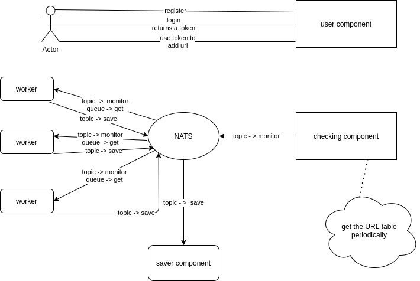

## Introduction
Well, well, well, I have the same project in my repository named HTTP_monitoring which does exactly the same thing,  
that project started to become larger and larger which was really hard to maintain that was when my friend and teacher 
[Parham Alvani](https://github.com/1995parham) suggested to change the project to smaller microservices that were much 
easier to maintain, here is how I want to break the project to smaller projects

## User repository
This repository is only responsible for creating and running the endpoints Register, Login and add 

## Saver repository
In the begging saver should make the tables in the database